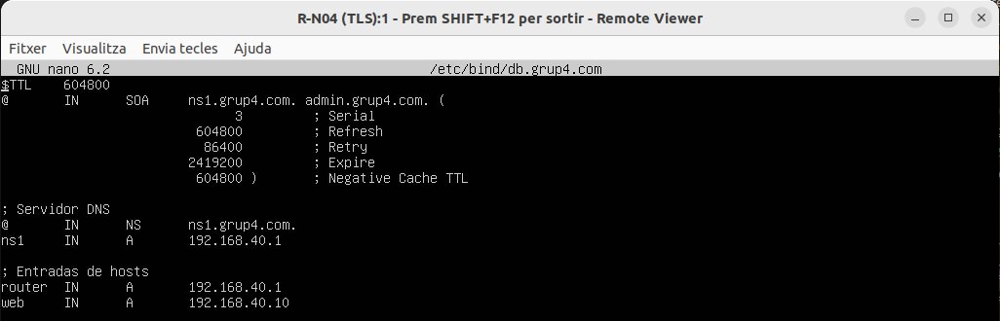
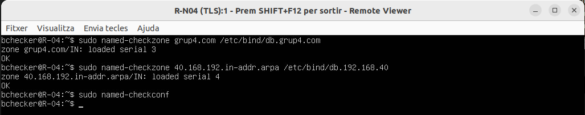
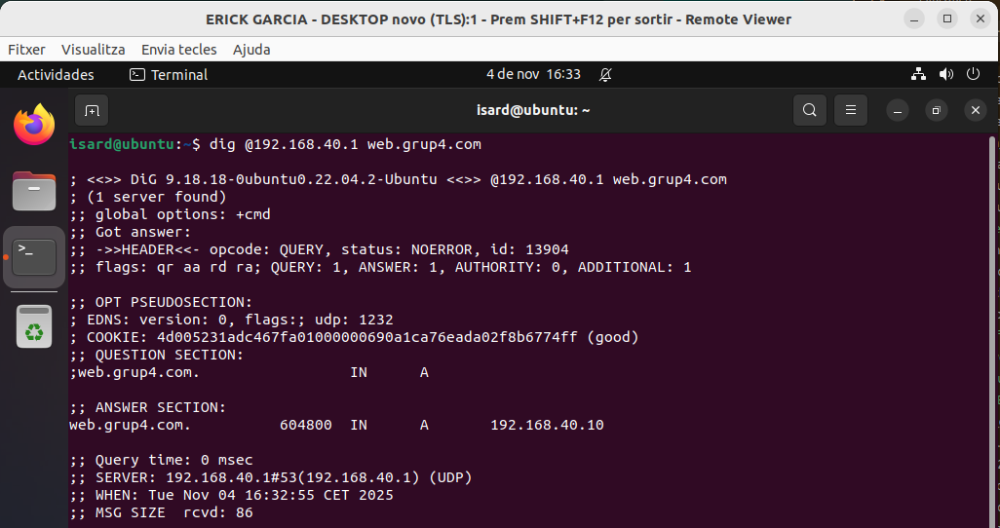
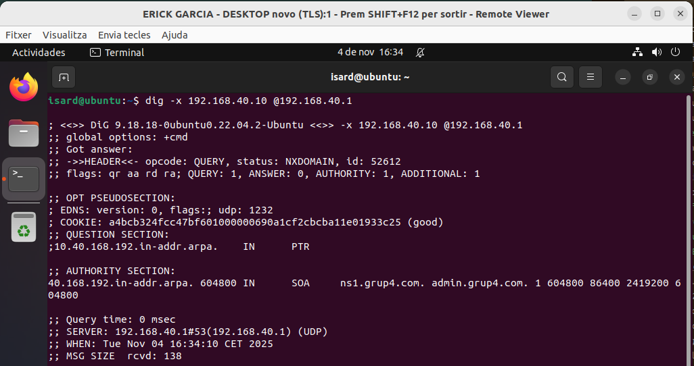

# Configuración del Servidor DNS (Bind9)

Este manual detalla los pasos necesarios para configurar un servidor DNS interno con Bind9 en un entorno Ubuntu Server.

---

## 1. Configuración de Opciones Globales

Configurar el archivo `/etc/bind/named.conf.options` para:

- Definir los servidores forwarders externos (ejemplo: Google DNS).
- Establecer las interfaces IP en las que Bind9 escuchará (ejemplo: localhost y IP interna del servidor).
- Permitir consultas (habitualmente para la red interna).
- Activar la recursividad necesaria para resolver consultas externas.

```bash
options {
directory "/var/cache/bind";
forwarders {
8.8.8.8;
8.8.4.4;
};
listen-on { 127.0.0.1; 192.168.40.1; };
allow-query { any; };
recursion yes;
};
```

---

## 2. Declaración de Zonas en Named

Una zona DNS es un segmento administrativo y de autoridad dentro del espacio total de nombres de dominio. Representa un dominio o subdominio y contiene los registros de nombres IP que el servidor DNS autoritativo maneja directamente.

- La zona directa (forward zone) contiene registros que resuelven nombres de host legibles (como web.grup4.com) a direcciones IP.

- La zona inversa (reverse zone) permite hacer la resolución inversa; es decir, obtener el nombre del host a partir de una dirección IP, utilizando registros PTR.

Definir explícitamente las zonas en named.conf.local con sus archivos respectivos (db.grup4.com, db.192.168.40) permite al servidor Bind9 conocer qué nombres y direcciones es responsable de resolver, facilitando administración segmentada y confiable.

Editar `/etc/bind/named.conf.local` para especificar las zonas que el servidor manejará.

Ejemplo de definición para zona directa e inversa:

```bash
zone "grup4.com" IN {
type master;
file "/etc/bind/db.grup4.com";
};

zone "40.168.192.in-addr.arpa" {
type master;
file "/etc/bind/db.192.168.40";
};
```

---

## 3. Archivo de Zona Directa (`db.grup4.com`)

Los registros DNS en las zonas cumplen funciones específicas:

- SOA (Start of Authority): Define el servidor principal de la zona y parámetros de administración, como tiempos de refresco y expiración.
- NS (Name Server): Especifica los servidores DNS autoritativos para la zona.
- A (Address): Asocia nombres de host a direcciones IPv4.
- PTR (Pointer): Usado en zonas inversas para mapear IPs a nombres. 

Mantener un número de serie en los archivos de zona es crucial para que los servidores secundarios puedan detectar cambios y actualizar sus copias mediante transferencias de zona.

Archivo de ejemplo para la zona `grup4.com`:

```bash
$TTL    604800
@       IN      SOA     ns1.grup4.com. admin.grup4.com. (
                            3           ; Serial
                            604800      ; Refresh
                            86400       ; Retry
                            2419200     ; Expire
                            604800 )    ; Negative Cache TTL

; Servidor DNS
@       IN      NS      ns1.grup4.com.
ns1     IN      A       192.168.40.1

; Entradas de hosts
router  IN      A       192.168.40.1
web     IN      A       192.168.40.10
```

<div align="center">
  
</div>

- Modificar el número de Serial cada vez que se edite el archivo.
- Añadir registros A para todos los hosts necesarios.

---

## 4. Archivo de Zona Inversa (`db.192.168.40`)

Archivo de ejemplo para la inversa de la red 192.168.40.0/24:

```bash
$TTL    604800
@       IN      SOA     ns1.grup4.com. admin.grup4.com. (
                            4           ; Serial
                        604800          ; Refresh
                        86400           ; Retry
                        2419200         ; Expire
                        604800 )        ; Negative Cache TTL

@       IN      NS      ns1.grup4.com.

1       IN      PTR     router.grup4.com.
10      IN      PTR     web.grup4.com.
```

<div align="center">
  
</div>

- Crear registros PTR para cada IP que requiera resolución inversa.

---

## 5. Validación de Configuración

Verificar sintaxis y configuración:

```bash
sudo named-checkconf
sudo named-checkzone grup4.com /etc/bind/db.grup4.com
sudo named-checkzone 40.168.192.in-addr.arpa /etc/bind/db.192.168.40
```

<div align="center">
  
</div>

Corregir cualquier error reportado antes de reiniciar el servicio.

---

## 7. Reinicio y Pruebas

Reiniciar el servicio Bind9 para aplicar los cambios:

```bash
sudo systemctl restart bind9
```

Verificar resolución DNS efectiva:

- Consulta directa:

<div align="center">
  
</div>

```bash
dig @192.168.40.1 router.grup4.com
```

---

<div align="center">
  
</div>

```bash
dig @192.168.40.1 web.grup4.com
```
---

- Consulta inversa:

<div align="center">
  
</div>

```bash
dig -x 192.168.40.10 @192.168.40.1
```

## 8. Buenas Prácticas

- Mantener actualizado el número de serie en las zonas ante modificaciones.
- Documentar cambios en configuraciones DNS para facilitar futuras revisiones.
- Limitar acceso a las consultas sólo a la red interna cuando sea necesario.
- Realizar backups periódicos de los archivos de configuración.
