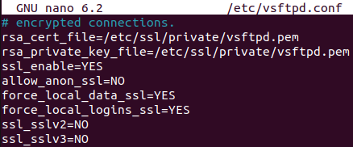
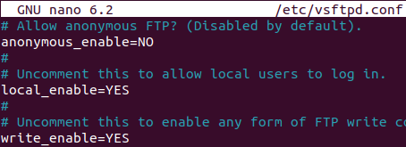
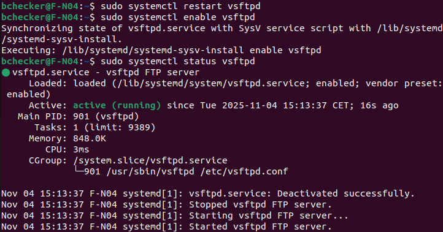

# Documentación: Despliegue y Configuración del Servidor FTP Seguro (vsftpd + FTPS)

## 1. Generación del certificado SSL autofirmado
Para habilitar FTPS (FTP seguro) se generó un certificado y clave privada:
```sql
sudo openssl req -x509 -nodes -days 365 -newkey rsa:2048
-keyout /etc/ssl/private/vsftpd.pem
-out /etc/ssl/private/vsftpd.pem
```


## 2. Configuración del archivo `/etc/vsftpd.conf`

Se modificó el archivo principal de configuración para:

- Habilitar usuarios locales.
- Permitir operaciones de escritura.
- Desactivar usuarios anónimos.
- Activar SSL y forzar su uso en datos/autenticación.
- Especificar la ruta de los certificados generados.
- Desactivar protocolos SSL inseguros.

Fragmentos relevantes:
```sql
anonymous_enable=NO
local_enable=YES
write_enable=YES

rsa_cert_file=/etc/ssl/private/vsftpd.pem
rsa_private_key_file=/etc/ssl/private/vsftpd.pem
ssl_enable=YES
allow_anon_ssl=NO
force_local_data_ssl=YES
force_local_logins_ssl=YES
ssl_sslv2=NO
ssl_sslv3=NO
```
<div align="center">
  
</div>

<div align="center">
  
</div>

## 3. Reinicio y activación del servicio

Para que los cambios tomen efecto se reinició y activó el servicio al arranque del sistema:
```sql
sudo systemctl restart vsftpd
sudo systemctl enable vsftpd
sudo systemctl status vsftpd
```
<div align="center">
  
</div>

## 4. Prueba de conexión FTPS

Se utilizó el comando `lftp` y `Filezilla` para establecer una conexión segura FTPS al servidor y comprobar la operativa (listado de archivos, subida/descarga):
```sql
lftp ftps://usuario@IP_DEL_SERVIDOR
```
Solo que daba el siguiente mensage de error:
```sql
Estado:    Conectando a 192.168.40.30:21...
Estado:    Conexión establecida, esperando el mensaje de bienvenida...
Estado:    Inicializando TLS...
Estado:    Conexión TLS establecida.
Comando:   USER bchecker
Respuesta: 331 Please specify the password.
Comando:   PASS ***********
Error:     Error GnuTLS -15 en gnutls_record_recv: Se recibió un paquete TLS inesperado.
Error:     No se pudo leer desde el socket: ECONNABORTED - Conexión abortada
Error:     No se pudo conectar al servidor
```

## 5. Canvio de protocolo de FTPS a SFTP
A pesar de que la conexión FTPS inicializaba y el cliente aceptaba el certificado, el servidor bloqueaba la comunicación, presentando errores recurrentes como Error GnuTLS -15 en gnutls_record_recv: Se recibió un paquete TLS inesperado y ECONNABORTED. La conexión TLS se establecía, pero el canal de datos o el listado de directorios fallaban sistemáticamente, impidiendo el funcionamiento normal del servicio.

Debido a estos problemas, y tras múltiples intentos de ajuste y diagnóstico, se decidió probar una alternativa más robusta y fácil de mantener: SFTP (SSH File Transfer Protocol), aprovechando la fiabilidad y el cifrado que proporciona SSH por defecto.

## 6. Comprobación y migración a SFTP (SSH File Transfer Protocol)
Tras los problemas con FTPS, se decidió probar el acceso SFTP, que utiliza el protocolo SSH y cifra todas las transferencias por defecto.

Cambios en la configuración:
Se editó el archivo /etc/ssh/sshd_config para cambiar el puerto predeterminado (22) al puerto 2222:


Se recargó el servicio SSH para aplicar los cambios:

```sql
sudo systemctl restart ssh
```
Prueba de acceso SFTP:
La conexión SFTP se realizó correctamente usando el usuario bchecker y el nuevo puerto 2222:

```sql
sftp -P 2222 bchecker@192.168.40.30
```
El listado y las operaciones con archivos funcionaron perfectamente.


## Conclusión:
El acceso SFTP funciona correctamente con el usuario local y el nuevo puerto 2222, ofreciendo seguridad, funcionalidad completa y evitando todos los problemas experimentados con FTPS y FTP tradicional.


