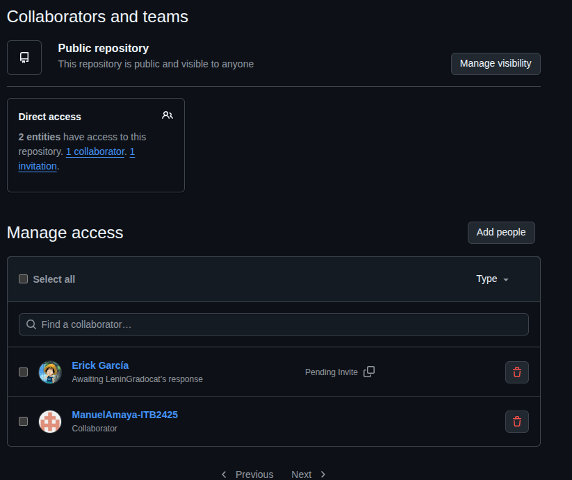
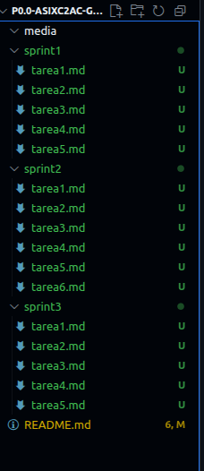
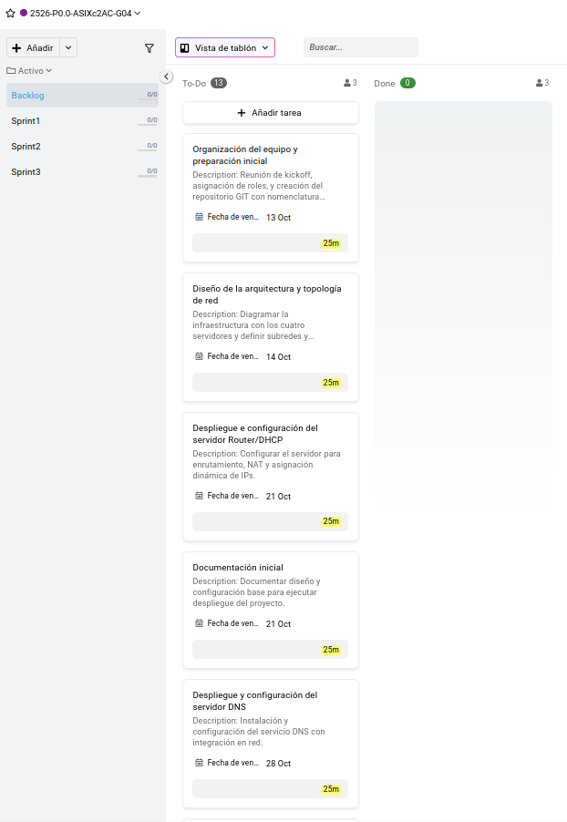

  <h1>Organización del equipo y preparación inicial</h1>

### Objetivo

Establecer la organización del grupo de trabajo y preparar el espacio común del proyecto utilizando GitHub y ProofHub, donde todo el equipo podrá compartir archivos y documentación.

---

### 1. Reunión inicial

- Junta breve con todos los miembros del grupo.
- Reparte los roles: scrum master, proyect manager...
- Aclara los objetivos y la forma de trabajar: organización (proofhub), uso de repositorio, entregas, etc.

---

### 2. Creación del repositorio en GitHub

- Accedemos a [GitHub](https://github.com/) y pulsamos en “Create a new repository”.
- Para el nombre del repositorio, usa el formato del proyecto:  
  `P0.0-ASIXc2AC-G04`

  

- Elige “Public” si todos pueden ver la repo, “Private” si solo el equipo.
> **Opcional:** Añade una pequeña descripción como “Proyecto de administración de sistemas - Grupo 04”.

**Añadir colaboradores**

- En la pestaña de “Settings” → “Collaborators”, podemos invitar al resto del grupo.
- Cada miembro debe aceptar la invitación para poder subir y modificar archivos.

  

**Estructura inicial del proyecto dentro de GitHub**

- Crea carpetas para cada sprint y para los medios (imágenes, diagramas).
- Sube el archivo README.md con el resumen del proyecto y los enlaces a los sprints y tareas.

  

---

## 5. Organización en Proofhub

- Se crea un espacio de trabajo para el proyecto en Proofhub.
- Allí se dividen las tareas según sprints, permitiendo asignar responsables y fechas.
- Se usan etiquetas y comentarios para seguimiento rápido.
- El equipo debe actualizar el progreso frecuentemente para mantener la sincronía.

  

---

Con esta tarea completada, el equipo tendrá todo organizado para empezar a trabajar juntos en cada sprint y tarea.
