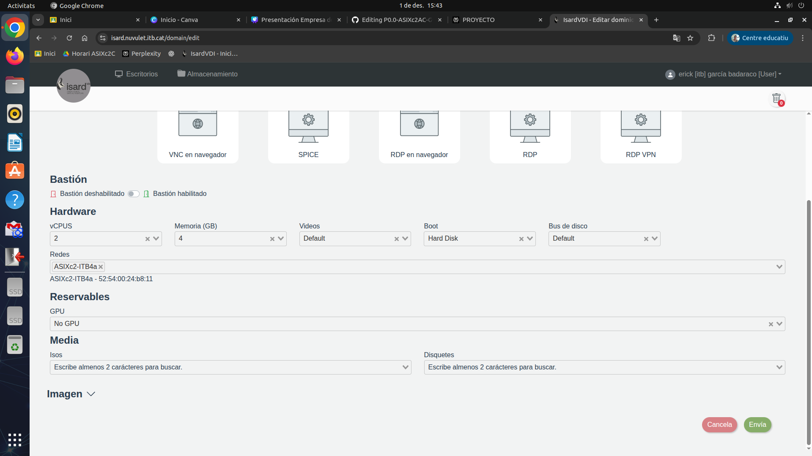
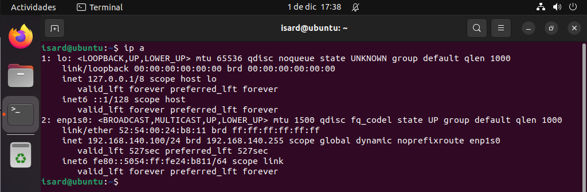
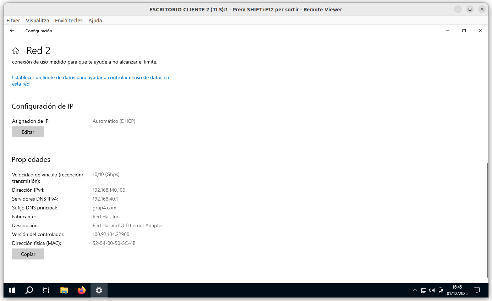

# Despliegue y configuracion de equipos cliente

Este documento describe cómo desplegar máquinas virtuales cliente (Windows y Linux) en el entorno Isardvdi, empleando exclusivamente el adaptador de red 'ITB4a' para su conexión hacia la intranet (192.168.140.0/24). Incluye pruebas de acceso a Internet y de resolución de nombres hacia el servidor web interno.

## 1. Configuración de red en Isardvdi

- Al crear o modificar la plantilla de VM en Isardvdi, selecciona **sólo el adaptador de red ITB4A**.
- Asegúrate de que el adaptador ITB4A está asignado a la intranet (vLAN/subred 192.168.140.0/24).
- Lanza el despliegue de VMs clientes a partir de esta plantilla.

Guarda la plantilla y despliega las VMs de alumnos/usuarios a partir de ella.​

<div align="center">
  
</div>

El equipo router R-N04 ya ofrece DHCP en 192.168.140.0/24 con gateway 192.168.140.1 y DNS 192.168.40.1 configurados en isc-dhcp-server.

## 2. Configuración en Clientes Linux

**Revisión de IP (DHCP):**

Comprobar que recibe IP por DHCP en ITB4a, eDeberías obtener una IP dentro del rango `192.168.140.100-150`, máscara `/24`.

Editar `/etc/netplan/00-installer-config.yaml`, jecutar:
```bash
ip a
```

<div align="center">
  
</div>

<div align="center">
  
</div>

Debe aparecer una IP del rango `192.168.140.100–150` con máscara /24 y gateway `192.168.140.1`.

## 3. Configuración en Clientes Windows

1. **IP y DNS por DHCP (recomendado):**
- Panel de control → Centro de redes → Cambiar configuración del adaptador
- Propiedades de la interfaz ITB4A → Protocolo TCP/IPv4:
  - Obtener IP automáticamente
  - Obtener DNS automáticamente

<div align="center">
  
</div>

 
## 4. Verificaciones Finales

- Comprobar que la IP de los clientes es del rango intranet.
- Confirmar acceso a la puerta de enlace (`192.168.140.1`).
- Validar resolución DNS: `web.grup4.com` debe resolver a `192.168.40.10`.
- Acceder al servidor web (W-N04) tanto por IP como por nombre.
- Probar acceso a Internet (si el router lo permite).

---

> **Notas**:
> - Todos los clientes deben utilizar únicamente el adaptador ITB4a y la subred 192.168.140.0/24 para todas las pruebas.
> - Si se usan direcciones estáticas, actualiza también configuración DNS manual.
> - Revisa siempre que el servidor DHCP y el servidor DNS estén activos y correctamente configurados.

---
