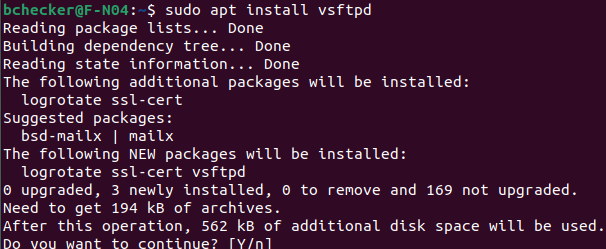
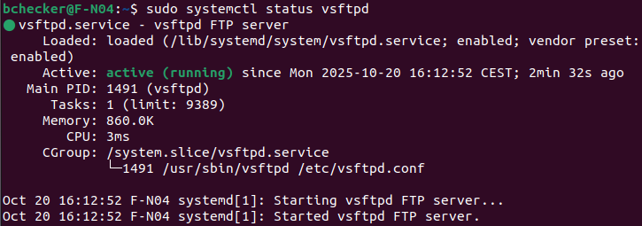

# Documentación de despliegue inicial del servidor FTP (F-N04)

## Instalación de vsftpd

Para el despliegue del servidor FTP en la máquina F-N04, se utilizó el paquete `vsftpd`, cumpliendo con la consigna del proyecto de levantar el servicio en la DMZ.  
Comando utilizado: 
```sql
sudo apt install vsftpd
```

Esto instala el servidor FTP junto con las dependencias necesarias, como muestra la siguiente evidencia:



## Inicio y habilitación del servicio

Una vez instalado, se procedió a iniciar el servicio y habilitarlo para que arranque automáticamente al iniciar el sistema: 
```sql
sudo systemctl start vsftpd
sudo systemctl enable vsftpd
```
Esta acción asegura que el servidor FTP esté siempre disponible tras un reinicio del sistema.  
Evidencia del proceso:


## Comprobación del estado del servicio

Para verificar que el servidor FTP se encuentra en ejecución y preparado para aceptar conexiones, se consultó el estado mediante: 
```sql
sudo systemctl status vsftpd
```

El resultado mostró que el servicio está activo y funcionando correctamente, como se evidencia aquí:



## Estado actual

- El servidor FTP `vsftpd` está correctamente instalado y en ejecución en F-N04.
- El despliegue se ha realizado sin errores y el servicio está habilitado en el arranque automático.
- Pendiente: Configuración detallada del servicio y pruebas de acceso.


