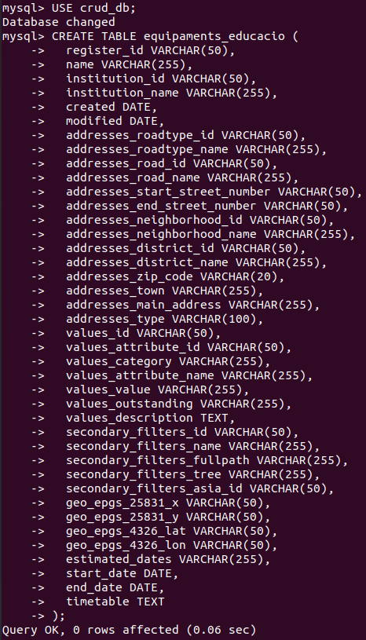
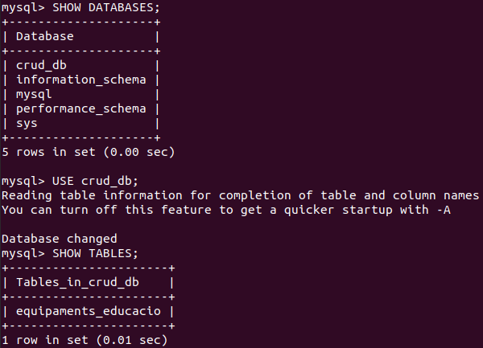
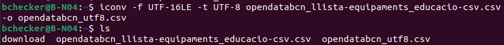
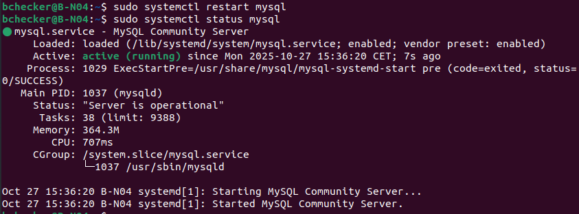
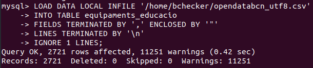
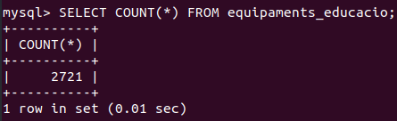
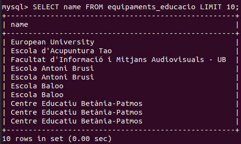
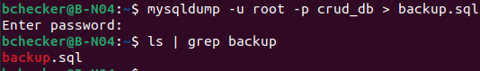

# Documentación Sprint 2: Servidor de Base de Datos

## 1. Creación de tabla

Se creó la tabla principal `equipaments_educacio` para almacenar los datos importados desde el CSV con la estructura detallada siguiente:

```sql
CREATE TABLE equipaments_educacio (
register_id VARCHAR(50),
name VARCHAR(255),
institution_id VARCHAR(50),
institution_name VARCHAR(255),
created DATE,
modified DATE,
addresses_roadtype_id VARCHAR(50),
addresses_roadtype_name VARCHAR(255),
addresses_road_id VARCHAR(50),
addresses_road_name VARCHAR(255),
addresses_start_street_number VARCHAR(50),
addresses_end_street_number VARCHAR(50),
addresses_neighborhood_id VARCHAR(50),
addresses_neighborhood_name VARCHAR(255),
addresses_district_id VARCHAR(50),
addresses_district_name VARCHAR(255),
addresses_zip_code VARCHAR(20),
addresses_town VARCHAR(255),
addresses_main_address VARCHAR(255),
addresses_type VARCHAR(100),
values_id VARCHAR(50),
values_attribute_id VARCHAR(50),
values_category VARCHAR(255),
values_attribute_name VARCHAR(255),
values_value VARCHAR(255),
values_outstanding VARCHAR(255),
values_description TEXT,
secondary_filters_id VARCHAR(50),
secondary_filters_name VARCHAR(255),
secondary_filters_fullpath VARCHAR(255),
secondary_filters_tree VARCHAR(255),
secondary_filters_asia_id VARCHAR(50),
geo_epgs_25831_x VARCHAR(50),
geo_epgs_25831_y VARCHAR(50),
geo_epgs_4326_lat VARCHAR(50),
geo_epgs_4326_lon VARCHAR(50),
estimated_dates VARCHAR(255),
start_date DATE,
end_date DATE,
timetable TEXT
);
```



## 2. Estructura y creación de la base de datos

Se comprobó la base de datos y tablas existentes, seleccionando la base de datos `crud_db` para trabajar en ella:

```sql
SHOW DATABASES;
USE crud_db;
SHOW TABLES;
```



## 3. Conversión del archivo CSV a UTF-8

El archivo CSV original estaba en formato UTF-16LE, por lo que se usó `iconv` para convertirlo a UTF-8 y evitar problemas de codificación durante la importación:

```sql
iconv -f UTF-16LE -t UTF-8 opendatabcn_llista-equipaments_educacio-csv.csv -o opendatabcn_utf8.csv
ls
```



## 4. Gestión y reinicio del servicio MySQL

Se reinició y comprobó el estado del servicio MySQL para garantizar un entorno operativo estable:

```sql
sudo systemctl restart mysql
sudo systemctl status mysql
```



## 5. Importación del archivo CSV

Se importó el archivo CSV ya convertido correctamente en UTF-8 con el comando:

```sql
LOAD DATA LOCAL INFILE '/home/bchecker/opendatabcn_utf8.csv'
INTO TABLE equipaments_educacio
FIELDS TERMINATED BY ',' ENCLOSED BY '"'
LINES TERMINATED BY '\n'
IGNORE 1 LINES;
```



## 6. Conteo de registros importados

Se comprobó el número total de registros importados para validar el éxito del proceso:

```sql
SELECT COUNT(*) FROM equipaments_educacio;
```



## 7. Visualización de datos y ejemplos

Se visualizaron algunas filas del contenido importado para verificar que los datos se muestran correctamente:

```sql
SELECT name FROM equipaments_educacio LIMIT 10;
```



## 8. Backup de la base de datos

Finalmente se realizó una copia de seguridad de la base de datos para asegurar la disponibilidad ante cualquier eventualidad:

```sql
mysqldump -u root -p crud_db > backup.sql
ls | grep backup
```


Esta estructurada correctamente con encabezados y bloques de código donde corresponde, y las imágenes ubicadas tras explicar cada sección.
